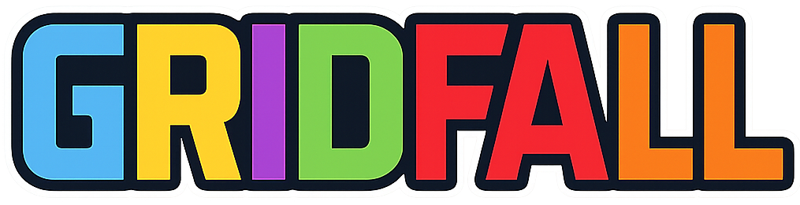

# Gridfall



A game about stacking blocks inside a grid.

## Release 1.0.3

[Play now on itch.io: dextercoding.itch.io/gridfall](https://dextercoding.itch.io/gridfall)  
There are also downloadable desktop versions for linux and windows available!

## Developer

 Christian Gewert <cgewert@gmail.com>

## Setup

```sh
npm install && npm run build:prod
```

will install all dependencies and build the application into the /dist folder.

NOTE: You can also build a dev version by using

```sh
npm run build:dev
```

## Run

```sh
npm start
```

will start the local development HTTP Server listening on Port 9000 by default.

## Developers

The Application consists of 3 Projects. You will find the vite / typescript / phaser based client source code inside the root folder.

### Client

Within the electron folder you will find a sub project for building the electron based desktop client running outside a web browser environment
as a native desktop application.

You need to install all dependencies by running (inside the /electron folder)

```sh
npm install
```

before you can build a platform specific game client with

```sh
npm run make:win 
```

or

```sh
npm run make:linux 
```

### Server

**The multiplayer server is currently in development and not yet functional.**

Inside the Server folder you will find a ASP.NET based C# Solution containing the multiplayer server code.
Just open the Solution with your .NET IDE.
